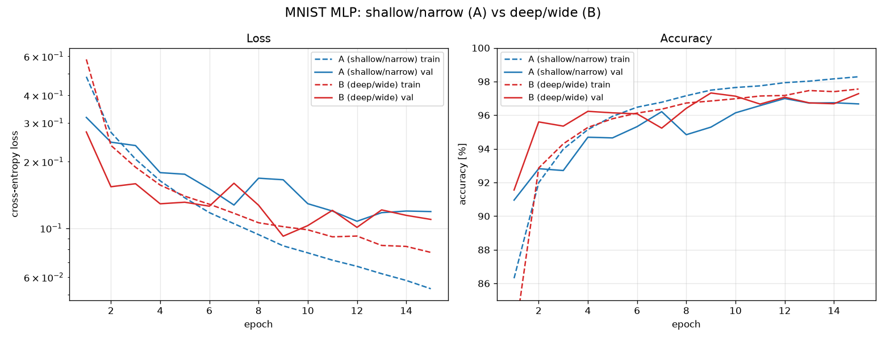

# Task 001 — MLP on MNIST: 두 네트워크 비교

과제 요구사항
1. MNIST를 train / validation / test **세 개**로 분할
2. 구조가 다른 MLP **두 개**를 같은 조건으로 학습
3. 학습 중에는 train·validation만 사용
4. 두 모델의 결과 비교

실행: `python mlp_compare.py` (결과는 `results/`에 저장)

---

## 1. 데이터 분할

MNIST는 train 60,000 / test 10,000만 제공하고 validation set이 없다.
그래서 **공식 train 60,000을 고정 시드(42)로 50,000 / 10,000으로 한 번만 쪼갰다.**

| set | 개수 | 용도 |
|---|---:|---|
| train | 50,000 | 파라미터 업데이트 |
| validation | 10,000 | 에폭마다 성능 확인 + **모델 선택** |
| test | 10,000 | 맨 마지막 딱 한 번만 |

두 모델이 **완전히 같은 분할**을 쓰도록 `torch.Generator().manual_seed(42)`를 넘겼다.
그래야 성능 차이가 데이터가 아니라 구조 때문이라고 말할 수 있다.

## 2. 두 모델

| | Model A (shallow / narrow) | Model B (deep / wide) |
|---|---|---|
| 구조 | 784 → 128 → 10 | 784 → 512 → 512 → 256 → 10 |
| 은닉층 | 1개 | 3개 |
| Dropout | 없음 | 0.2 |
| 파라미터 | 101,770 | 798,474 (약 7.8배) |

나머지 조건은 전부 동일: CrossEntropyLoss, RMSprop(lr=1e-3), batch 128, 15 epoch, 같은 초기화 시드.

> 예제 코드(`mlp.py`)는 `optim.RMSprop(model.parameters())`를 썼는데 이때 lr 기본값이 0.01이라
> 학습이 튄다. lr을 1e-3으로 명시해서 두 모델 모두 안정적으로 수렴하게 했다.

## 3. 결과



| model | 파라미터 | best epoch | val acc | **test acc** | 최종 train acc | 학습 시간(CPU) |
|---|---:|---:|---:|---:|---:|---:|
| A (shallow/narrow) | 101,770 | 12 | 96.87% | **96.94%** | 98.31% | 219 s |
| B (deep/wide) | 798,474 | 13 | 97.43% | **97.46%** | 97.29% | 280 s |

## 4. 해석 — 여기가 과제의 핵심

**(1) 큰 모델이 이겼지만 차이는 작다.** 파라미터를 7.8배 늘렸는데 test accuracy는 96.94% → 97.46%,
0.5%p 개선에 그쳤다. MNIST + MLP 조합은 이미 성능이 포화 상태고, 공간 정보를 못 쓰는
fully-connected 구조의 한계(다음 과제인 CNN이 필요한 이유)가 여기서 드러난다.

**(2) 과적합 양상이 정반대다.** 왼쪽 loss 그래프를 보면

- **A**: train loss(파란 점선)는 계속 떨어지는데 val loss(파란 실선)는 8 epoch쯤부터 정체한다.
  최종 train acc 98.31% vs val 96.87% → **gap 1.44%p, 전형적인 과적합.**
  용량이 작은 모델도 규제가 없으면 학습 데이터를 외운다.
- **B**: train acc 97.29% vs val 97.43%로 **val이 오히려 더 높다.** Dropout이 학습 때만 켜지기
  때문에 나타나는 현상으로, 아직 과적합 구간에 들어가지도 않았다는 뜻이다.
  즉 B는 더 오래 학습시키면 더 올라갈 여지가 있다.

**(3) 파라미터 수보다 규제가 중요했다.** B가 이긴 진짜 이유는 "크다"기보다 dropout이 있기
때문이다. 이걸 검증하려면 B에서 dropout만 빼고 다시 돌려보면 된다 (아래 확장 과제).

**(4) validation set이 실제로 일을 했다.** 두 모델 다 마지막 에폭(15)이 최고가 아니었다.
A는 12, B는 13 에폭이 best였고, 그 시점의 가중치를 저장해서 test를 봤다.
val 없이 "마지막 에폭 모델"을 그냥 썼다면 A는 96.87→96.8%대, B는 97.43→97.41%로 조금씩 손해였다.

## 5. 더 해볼 만한 것 (면담 때 얘기하기 좋은 부분)

- B에서 dropout만 제거 → 성능 차이가 깊이·너비 때문인지 규제 때문인지 분리
- 같은 파라미터 예산(약 80만 개)을 얕고 넓게 vs 깊고 좁게 배분해서 비교
- BatchNorm 추가, optimizer를 Adam/SGD+momentum으로 교체
- test set 오분류 샘플만 모아서 보기 → 어떤 숫자 쌍(4↔9, 3↔5)에서 틀리는지

## 6. 파일

```
001 MLP/
├── mlp_compare.py            # 전체 코드 (이거 하나만 실행하면 됨)
├── report.md                 # 이 문서
├── run.log                   # 실행 로그
└── results/
    ├── learning_curves.png   # train/val loss·accuracy 곡선
    ├── predictions_A.png     # A 모델 테스트 샘플 예측 (틀린 건 빨간 제목)
    ├── predictions_B.png     # B 모델 테스트 샘플 예측
    ├── summary.json          # 요약 수치
    ├── history.json          # 에폭별 기록
    ├── model_A.pt            # best-val 가중치
    └── model_B.pt
```
