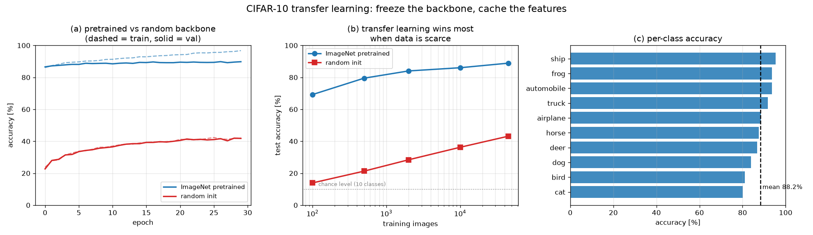

# 01-002 CNN & Classification

## 과제 (노션 공식)

> `train.py`, `cnn_network.py` 두 개의 파일을 업로드 하고, 정확도를 기록하세요.
> **Imagenet 데이터셋으로 Pretrain 된 CNN을 이용하세요.**

- CNN 아키텍처를 직접 설계하지 말고 잘 만들어진 것을 가져올 것
- 뒷부분 fully-connected 만 바꿔 분류할 것
- CNN 층은 freeze 해도 좋다

데이터셋: **CIFAR-10** (10 클래스, 32×32 컬러, train 50,000 / test 10,000)

## 최종 결과

| | test accuracy |
|---|---:|
| **ImageNet 사전학습 ResNet18 + 새 FC 헤드** | **88.24 %** |

실행 환경: RTX 5070 Laptop, PyTorch cu128

---

## 구성

```
이미지 224×224
   ↓
ResNet18 (ImageNet 사전학습, 전체 freeze)     ← cnn_network.py: get_backbone()
   ↓
512차원 feature
   ↓
Linear(512→256) → ReLU → Dropout(0.3) → Linear(256→10)   ← ClassifierHead
   ↓
10개 클래스 logit
```

`net.fc = nn.Identity()` 로 ResNet18의 원래 분류층(1000 클래스 ImageNet용)을 떼어내면
avgpool 출력인 512차원 feature 가 그대로 나온다. 여기에 우리 헤드를 붙였다.

### freeze 를 캐시로 바꾼 것

backbone 이 freeze 라서 **같은 이미지는 매 에폭 똑같은 feature 를 낸다.**
그러면 매 에폭 ResNet18 을 통과시킬 이유가 없다.

딱 한 번만 통과시켜 512차원 feature 를 `shared/cifar10_resnet18_fp16.npz` 로 저장했다.

| | 시간 |
|---|---:|
| feature 추출 (60,000장, 최초 1회) | 약 2분 |
| 헤드 학습 30에폭 | **8초** |

Step 4 의 데이터 양 스윕에서 헤드를 10번 더 학습했는데, 캐시 덕분에 전부 합쳐도 1분이 안 걸렸다.
fp16 으로 저장해 용량을 절반으로 줄였고 (정확도 차이는 없다), 그래서 git 으로 두 노트북 사이 동기화가 된다.

---

## 실험 1 — 사전학습 가중치가 값어치가 있나

같은 ResNet18 구조, 같은 헤드, 같은 학습 예산(30에폭). **다른 건 백본 가중치 하나뿐.**

| 백본 | test | val | 헤드 학습 |
|---|---:|---:|---:|
| (a) ImageNet 사전학습 | **88.24 %** | 89.84 % | 8초 |
| (b) 랜덤 초기화 | 42.36 % | 41.94 % | 8초 |

**차이 +45.88 %p.**

랜덤 초기화가 42%나 나온 게 오히려 눈에 띈다. 찍으면 10%인데 그보다 훨씬 높다.
학습된 적 없는 conv 필터도 이미지를 512차원으로 **무작위 투영**하는 역할은 하고,
그 투영이 원본 픽셀보다는 선형 분리에 유리하기 때문이다.
다만 그 512차원에 "무엇이 찍혀 있는지"에 대한 정보는 없다.

사전학습 백본의 512차원에는 ImageNet 120만 장을 보며 만들어진
모서리·질감·부위·물체 단위 표현이 들어 있다. CIFAR-10 을 한 장도 안 봤는데도
그 표현 위에서는 선형 분류기 하나로 88%가 나온다.

---

## 실험 2 — 데이터가 적을 때 (전이학습의 진짜 값어치)

학습에 쓰는 이미지 수를 줄여가며 같은 비교를 반복했다.

| 학습 데이터 | 사전학습 | 랜덤 | 차이 |
|---:|---:|---:|---:|
| 100 장 | 69.25 % | 13.94 % | +55.3 %p |
| 500 장 | 79.51 % | 21.31 % | +58.2 %p |
| 2,000 장 | 84.03 % | 28.41 % | +55.6 %p |
| 10,000 장 | 86.04 % | 36.24 % | +49.8 %p |
| 45,000 장 | 88.90 % | 43.18 % | +45.7 %p |



### 관찰 1 — 100장이 45,000장을 이긴다

**사전학습 100장 (69.25%) > 랜덤 45,000장 (43.18%).**

데이터 450배 차이를 백본 가중치 하나가 뒤집었다.
전이학습을 쓰는 이유가 이 한 줄에 다 있다.

### 관찰 2 — 격차는 데이터가 적을수록 벌어진다

차이가 100장에서 500장 사이 최대(+58.2%p)를 찍고, 데이터가 늘수록 좁아진다.
랜덤 백본은 데이터를 100장→45,000장 (450배) 늘려 +29.2%p 를 얻었는데,
사전학습 백본은 같은 450배로 +19.6%p 밖에 못 얻었다.

사전학습 쪽은 **이미 100장에서 대부분을 가져갔기 때문**이다.
헤드가 배워야 할 게 "512차원 공간에서 10개 클래스를 가르는 경계" 뿐이라
표본이 조금만 있어도 충분하다. 반대로 랜덤 쪽은 쓸 만한 표현이 없으니
데이터로 밀어붙이는 수밖에 없고, 그래서 데이터에 훨씬 민감하다.

### 관찰 3 — 사전학습 쪽도 88~89%에서 멈춘다

45,000장을 다 써도 88.90%다. 백본이 freeze 라 CIFAR-10 에 맞춰
표현 자체를 다듬을 수 없기 때문이다. 더 올리려면 backbone 뒷단 몇 층을
작은 학습률로 같이 푸는 fine-tuning 이 필요한데, 그러면 캐시를 못 쓰고
학습 시간이 백 배쯤 늘어난다. 이번 과제 범위에서는 여기까지가 합리적인 지점이다.

---

## 클래스별 정확도

그림 (c). 상위/하위가 갈리는 방식이 예상대로다.

- **잘 맞히는 쪽**: automobile, ship, truck, airplane — 배경(도로·바다·하늘)이 단서를 준다
- **못 맞히는 쪽**: cat, dog, bird, deer — 네 다리 동물끼리 형태가 겹치고, 자세 변화가 크다

고양이/개 혼동은 CIFAR-10 에서 고전적인 실패 지점이다.
32×32 를 224×224 로 늘린 거라 원본에 없는 디테일이 생기지도 않는다.

---

## 파일

```
002_CNN/
├── cnn_network.py   ← 제출물. backbone / head 정의 + feature 추출
├── train.py         ← 제출물. 학습 및 실험 (main() + __main__ 가드)
├── report.md        ← 이 문서
└── results/
    ├── cnn_transfer.png     ← 제출 그림
    ├── head_pretrained.pt   ← 학습된 헤드 가중치
    └── summary.json
```

feature 캐시는 `shared/` 에 있다 (`cifar10_resnet18_fp16.npz`,
`cifar10_resnet18_random_fp16.npz`, 각 52.8 MB).

### 삽질 기록 — Windows 의 spawn

처음엔 파일 하나(`cnn_transfer.py`)에 실행 코드를 전부 모듈 최상단에 뒀다.
리눅스에서는 잘 돌았는데 윈도우에서 `DataLoader(num_workers=4)` 가 터졌다.

리눅스는 `fork` 로 워커를 만들지만 윈도우는 `fork` 가 없어 `spawn` 을 쓴다.
spawn 은 자식 프로세스에서 **메인 모듈을 처음부터 다시 import** 하므로,
최상단에 실행 코드가 있으면 그 안에서 또 워커를 띄우려 하고 무한히 증식한다.

해결은 실행 코드를 전부 `main()` 안으로 넣고 `if __name__ == "__main__":` 로 막는 것.
노션이 요구한 `train.py` / `cnn_network.py` 분리와 방향이 같아 한 번에 처리했다.
