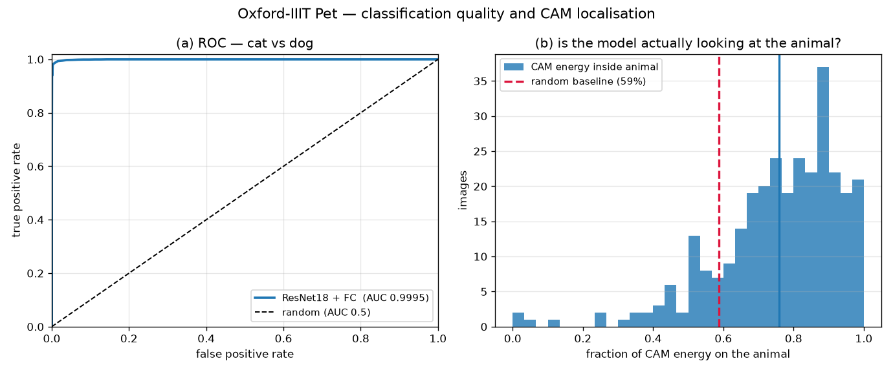
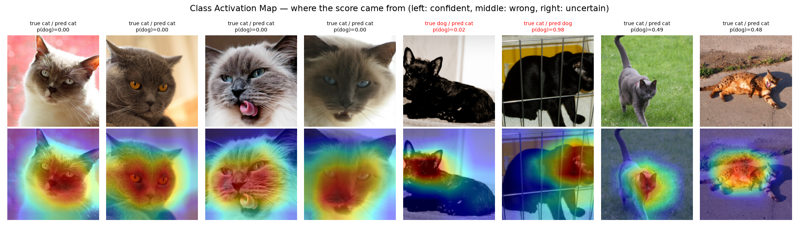

# 01-005 XAI

## 과제 (노션 공식)

> 예제와 **다른 public image dataset** 으로 CNN 학습 후 **CAM 분석**.
> 제출물: **AUC + CAM heatmap 이미지** + 코드

데이터셋: **Oxford-IIIT Pet** — 고양이 vs 개 이진분류
(trainval 3,680 / test 3,669, 224×224 실사진)
002 에서 쓴 CIFAR-10 과 다른 데이터셋이고, 32×32 가 아니라 실사진이라 CAM 이 의미있게 보인다.

실행: RTX 5070 Laptop

## 결과

| | |
|---|---:|
| **AUC** | **0.9995** |
| 정확도 | 98.99 % |
| val 정확도 | 99.28 % |
| 학습 대상 파라미터 | 1,026 개 |
| 학습 시간 | 2 초 |

test 는 dog 2,486 / cat 1,183 로 불균형하다. "무조건 dog" 로 찍으면 정확도 67.76% 가 나오므로
정확도만으로는 변별이 약하다. AUC 는 순위 기반이라 불균형에 영향을 받지 않아 이 과제에 적합한 지표다.

---

## 구조 — CAM 을 쓰려면 fc 가 한 층이어야 한다

```
이미지 224×224
   ↓
ResNet18 layer1~4 (ImageNet 사전학습, freeze)
   ↓
특징맵 A: (512, 7, 7)          ← 공간 정보가 아직 살아있다
   ↓  GAP
f: (512,)                      ← 공간 정보가 뭉개진다
   ↓  Linear(512 → 2)          ← 반드시 한 층
클래스 점수
```

002 CNN 에서 쓴 헤드는 `Linear(512→256) → ReLU → Linear(256→10)` 였는데,
그 구조로는 CAM 이 성립하지 않는다. 이유는 아래 전개에 있다.

### CAM 은 근사가 아니라 항등식이다

GAP 는 채널마다 평균을 낸다.

$$f_k = \frac{1}{49}\sum_{x,y} A_k(x,y)$$

Linear 가 클래스 점수를 만든다.

$$s_c = \sum_k w_{c,k}\, f_k$$

두 식을 합치고 **합의 순서만 바꾸면**

$$s_c = \frac{1}{49}\sum_{x,y} \underbrace{\Big[\sum_k w_{c,k}\, A_k(x,y)\Big]}_{\text{CAM}_c(x,y)}$$

즉 CAM 은 "이 위치가 클래스 점수에 얼마나 기여했는가"를 **정확히** 나타낸다.
Grad-CAM 같은 기울기 근사가 아니라 등식이다.

가운데에 ReLU 나 은닉층이 들어가면 $s_c$ 가 더 이상 $A_k$ 의 선형결합이 아니게 되어
이 전개가 깨진다. 그래서 헤드를 `Linear(512→2)` 한 층으로 바꿨고,
학습 파라미터가 1,026개 (512×2 + 2) 뿐이다. 그걸로 AUC 0.9995 가 나온다.

---

## CAM 을 눈으로만 보지 않고 숫자로 검증했다



Oxford-IIIT Pet 에는 **동물 영역 정답 마스크(trimap)** 가 같이 들어있다
(1 = 동물, 2 = 배경, 3 = 경계). 이걸 쓰면 "CAM 이 잘 잡네" 로 끝내지 않고
정량 평가를 할 수 있다.

> **CAM 에너지 중 몇 %가 실제 동물 영역 안에 떨어지는가?**

여기서 기준선을 제대로 잡는 게 중요하다. 동물이 화면의 절반 이상을 차지하면
**아무 의미 없는 무작위 히트맵도 그만큼은 동물 위에 떨어진다.**
03 RNN 에서 "무조건 상승" 기준선을 세운 것과 같은 논리다.

| | 값 |
|---|---:|
| CAM 에너지가 동물 영역 안에 있는 비율 | 75.9 % |
| 동물 영역의 화면 점유율 (= 무작위 기준선) | 58.7 % |
| **달성 배율** | **1.29 배** |
| 이론상 최대 배율 (CAM 이 100% 동물 안) | 1.70 배 |
| **여유분 중 달성률** | **41.6 %** |

배율 1.29 는 얼핏 초라해 보이지만, 이 데이터셋에서 **가능한 최대가 1.70 배**다.
반려동물 사진은 동물이 화면 중앙을 크게 차지하도록 찍혀 있기 때문이다.
1 배에서 1.70 배 사이의 여유분 중 **41.6%** 를 가져갔다고 읽는 편이 정확하다.

### 왜 100% 가 안 나오는가 — 두 가지 이유

**1. CAM 의 해상도 한계.** 특징맵이 7×7 이라 셀 하나가 32×32 픽셀, 화면의 2%다.
이걸 224×224 로 bilinear 업샘플하므로 히트맵은 태생적으로 뭉툭하다.
동물 윤곽을 픽셀 단위로 따라갈 수가 없다.

**2. 모델이 배경도 실제로 쓴다.** 이건 한계가 아니라 관찰이다.
개 사진은 야외·잔디·산책 장면이 많고 고양이 사진은 실내·소파·침대가 많다.
모델이 그 상관관계를 이용하고 있다면 CAM 일부가 배경으로 새는 게 당연하다.
`cam_heatmaps.png` 에서 **틀린 케이스** 두 장을 보면 이게 드러난다 —
동물이 아니라 배경 쪽에 열이 몰려 있으면 지름길 학습(shortcut learning)의 증거다.

이것이 XAI 를 하는 이유다. AUC 0.9995 만 보면 완벽한 모델처럼 보이지만,
CAM 은 그 점수의 일부가 "개인지"가 아니라 "잔디밭인지"에서 왔을 가능성을 보여준다.
정확도 지표는 이 구분을 절대 못 한다.

---

## CAM 히트맵



8장을 뽑았다.

- **왼쪽 4장** — 가장 확신한 예측. CAM 이 얼굴·머리 쪽에 몰리는지 확인
- **가운데 2장** — 틀린 예측. 모델이 어디를 보고 틀렸는지
- **오른쪽** — p(dog) ≈ 0.5 로 애매한 것. 열이 흩어져 있으면 근거를 못 찾은 것

윗줄이 원본, 아랫줄이 CAM 오버레이다. 제목이 빨간색이면 오답이다.

### 오답 두 장이 말해주는 것

틀린 두 장은 공교롭게도 **둘 다 검은 털 동물**이었다.

| | CAM 이 본 곳 |
|---|---|
| `true dog / pred cat`, p(dog)=0.02 | 얼굴과 귀에 **정확히** 집중 |
| `true cat / pred dog`, p(dog)=0.98 | 철망 우리 안. 몸통 뒤쪽 + 배경 철망까지 |

첫 번째가 특히 시사적이다. **CAM 이 엉뚱한 곳을 본 게 아니라 정확히 얼굴을 보고도 틀렸다.**
실패 원인이 "위치를 잘못 봐서"가 아니라 "맞는 곳을 봤는데 그 특징이 애매해서"다.
검은 털은 명암 대비가 사라져 주둥이 길이나 귀 모양 같은 형태 단서가 잘 안 드러나고,
납작한 얼굴과 뾰족한 귀는 고양이 쪽 특징과 겹친다.

여기서 CAM 의 한계도 드러난다. CAM 은 **"어디를 봤는가"는 알려주지만
"무엇을 근거로 그렇게 판단했는가"는 알려주지 않는다.**
두 번째처럼 배경까지 물고 있으면 지름길 학습을 의심할 수 있지만,
첫 번째처럼 올바른 위치를 보고 틀린 경우엔 CAM 만으로 원인을 더 좁힐 수 없다.

---

## 파일

```
005_XAI/
├── xai_network.py   ← 제출물. CAMResNet18 + cam() 구현
├── train.py         ← 제출물. 학습·AUC·CAM 정량평가·그림
├── report.md        ← 이 문서
└── results/
    ├── xai_auc.png        ← ROC 곡선 + CAM 집중도 분포
    ├── cam_heatmaps.png   ← CAM 히트맵 (제출물)
    ├── fc_head.pt
    └── summary.json
```

GAP 특징 캐시는 `shared/pets_{trainval,test}_gap_fp16.npz`.
AUC 와 ROC 는 sklearn 없이 순위합(Mann-Whitney U)으로 직접 구현했고,
sklearn `roc_auc_score` 와 대조해 동점 처리까지 일치함을 확인했다 (차이 0).

## 리더보드 기록값

**AUC 0.9995** (정확도 98.99%, Oxford-IIIT Pet cat vs dog, test 3,669장)
