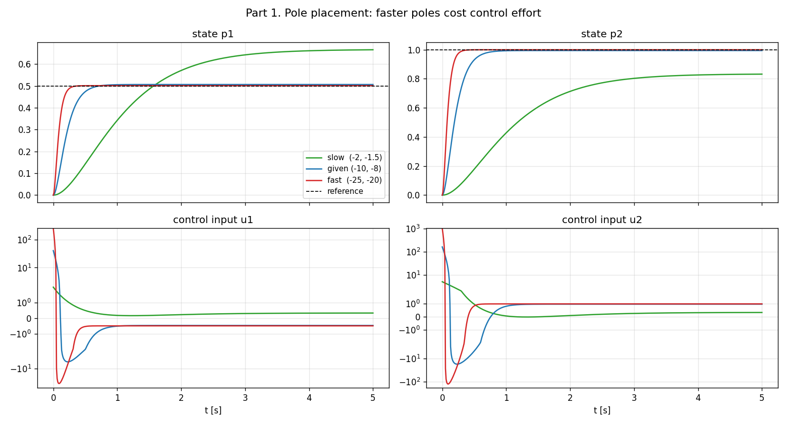
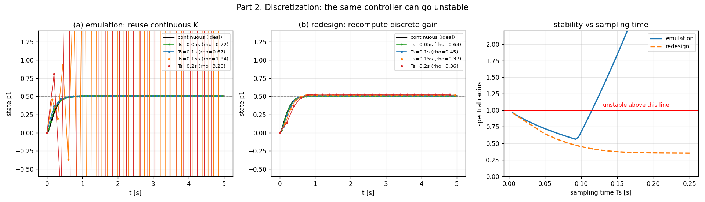
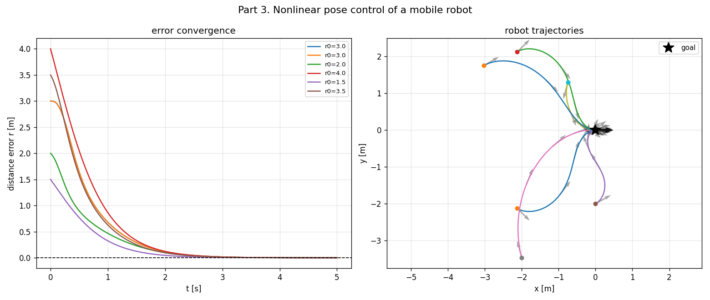

# 02-001 Introduction to Control

실행: `python intro_control.py` (결과는 `results/`에 저장, numpy·scipy·matplotlib만 필요)

> **과제문에 대해**: 깃허브 레포의 `02 Optimal Control`에는 다른 챕터와 달리 readme 과제문이
> 없다. 강의노트(HTML/PDF)와 예제 코드만 있다. 그래서 예제 코드
> (`linear_systems.py`, `nonlinear_systems.py`)를 기준으로,
> **"파라미터를 바꿔가며 무엇이 달라지는지"** 를 확인하는 형태로 구성했다.
> 노션에 공식 과제문이 있다면 그쪽에 맞춰 다시 정리하면 된다.

대상 시스템은 예제 코드와 동일한 4상태·2입력 선형 시스템이다.

$$x = [p_1, p_2, v_1, v_2]^T, \quad u = [u_1, u_2]^T, \quad \dot{x} = Ax + Bu$$

---

## Part 1. 극점을 어디에 둘 것인가

### 먼저 가제어성 확인

강의자료에 eigenstructure assignment 조건으로 *"if the system is completely controllable"* 이
붙어 있다. 그래서 가제어성 행렬 $[B\ AB\ A^2B\ A^3B]$ 의 랭크부터 봤다.

```
가제어성 행렬 (4, 8), rank = 4 = n   ->  완전 가제어
개루프 고유값: -1.183±1.527j,  -0.317±0.409j
```

랭크가 n이므로 **닫힌루프 극점을 원하는 곳에 마음대로 놓을 수 있다.**
개루프도 이미 안정(실수부 전부 음수)이지만 느리다. 특히 -0.317 쪽 극점이 응답을 지배한다.

### 극점 세 세트 비교

예제 코드는 $\lambda = -10, -8$ 을 쓴다. 왜 하필 그 값인지는 안 나와 있어서,
느린 것과 빠른 것을 같이 놓고 비교했다.



| 극점 | 정착시간 | max·\|u\| | max·\|K\| | 정상상태 오차 |
|---|---:|---:|---:|---:|
| slow (-2, -1.5) | 5.00 s 이상 | **5.0** | 5.0 | **0.167** |
| given (-10, -8) | 0.71 s | 159 | 158 | 0.0062 |
| fast (-25, -20) | **0.27 s** | **999** | 998 | 0.0010 |

### 해석

**(1) 빠르게 만드는 값은 제어입력으로 낸다.** 정착시간을 5초에서 0.27초로 줄이는 대신
제어입력 최대값이 5에서 999로 **200배** 뛴다. 극점을 왼쪽으로 옮기면 응답이 빨라진다는 건
교과서적 사실이지만, 그 대가가 얼마인지는 이렇게 돌려봐야 보인다.

이게 왜 중요하냐면 **실제 액추에이터에는 한계가 있기 때문이다.** 모터 토크든 밸브 개도든
u가 999까지 못 간다. 그런데 극점 배치는 그 한계를 **모른다.** 설계 단계에서 u의 크기를
직접 제약할 방법이 없고, 극점을 이리저리 옮겨보며 사후에 확인하는 수밖에 없다.

**(2) 정상상태 오차가 이득 크기에 딸려온다.** 여기서 쓴 제어법칙은

$$u = K(x_{ref} - x)$$

인데, 이 구조는 **정상상태 오차가 0이라는 보장이 없다.** 정상상태를 풀어보면

$$x_{ss} = -(A - BK)^{-1} BK\, x_{ref}$$

이고 이게 $x_{ref}$ 와 같아질 이유가 없다. 실제로 느린 이득에서는 오차가 **0.167**로 꽤 크고
(그래프에서 초록선이 p1은 0.5를 넘어 0.66으로, p2는 1.0에 못 미쳐 0.83으로 간다),
이득을 키우면 0.001까지 줄어든다. 고이득으로 **가리는** 것이지 없앤 게 아니다.

제대로 없애려면 feedforward 항을 계산해 넣거나 적분기(integral action)를 추가해야 한다.

---

## Part 2. 이산화 — 실제 제어기는 컴퓨터에서 돈다

연속시간에서 설계는 끝났다고 치자. 이걸 마이크로컨트롤러에 올리면 샘플링 주기 $T_s$ 마다
한 번씩만 계산하고 그 사이에는 입력을 붙잡고(zero-order hold) 있다. 여기서 문제가 생긴다.

두 가지 방법을 비교했다. 극점은 $-10, -8$ 로 고정.

- **(a) emulation** — 연속시간 이득 $K$ 를 그대로 이산 루프에 갖다 쓴다. 제일 흔한 방식
- **(b) redesign** — 연속 닫힌루프 천이행렬 $e^{(A-BK)T_s}$ 를 재현하도록 이산 이득을 다시 구한다.
  **예제 코드가 하는 것이 이쪽이다**



| $T_s$ | (a) emulation 스펙트럴 반경 | (b) redesign 스펙트럴 반경 |
|---:|---:|---:|
| 0.05 s | 0.72 | 0.64 |
| 0.10 s | 0.67 | 0.45 |
| 0.15 s | **1.84 → 발산** | 0.37 |
| 0.20 s | **3.20 → 발산** | 0.36 |

이산 시스템은 $(A_d - B_d K_d)$ 의 고유값이 **전부 단위원 안**에 있어야 안정하다.
스펙트럴 반경(최대 \|고유값\|)이 1을 넘으면 발산한다.

### 해석

**연속시간에서 완벽하게 안정한 제어기가, 샘플링을 느리게 하는 것만으로 발산한다.**
(a)에서 $T_s$가 0.1에서 0.15로 바뀌는 순간 스펙트럴 반경이 0.67에서 1.84로 튄다.
제어기도 시스템도 안 바꿨는데 말이다. 오른쪽 그래프에서 파란선이 0.11초 근처에서 1을 뚫는다.

직관적으로는, 이득 158짜리 제어기가 0.2초 동안 입력을 붙잡고 있으면 **과보정**을 한다.
다음 스텝에서 반대로 과보정하고, 진폭이 커지며 발산한다. 이득이 클수록 이 현상이 빨리 온다.
Part 1에서 "빠른 극점이 공짜가 아니다"라고 한 게 여기서 두 번째 청구서로 돌아온다.

(b)처럼 이산 영역에서 다시 설계하면 $T_s$가 커져도 안정을 유지한다.
느려진 만큼 성능은 떨어지지만(정상상태 오차 증가) 최소한 발산하지는 않는다.

**실무 교훈**: 제어 주기를 정하는 건 성능 튜닝이 아니라 **안정성 문제**다.
그리고 연속시간 설계를 그대로 옮기면 안 된다.

---

## Part 3. 비선형 시스템 — 이동로봇 자세 제어

앞은 전부 선형이었다. 비선형은 다르게 접근한다.
차동구동 로봇(unicycle)을 극좌표 오차 $e = [r, \alpha, \phi]$ 로 표현하면

$$\dot{r} = -v\cos\alpha, \quad \dot{\alpha} = \frac{v\sin\alpha}{r} - \omega, \quad \dot{\phi} = -\frac{v\sin\alpha}{r}$$

여기엔 $\cos\alpha$, $\sin\alpha / r$ 처럼 선형화가 안 되는 항이 있다. 그래서 극점 배치를 못 쓰고,
**안정성 논증(Lyapunov)으로 제어법칙을 손으로 유도한다.**

예제 코드의 초기자세 하나만으로는 우연인지 알 수 없어서, 초기자세 6개로 돌렸다.



6개 전부 목표 자세로 수렴했다 (최종 거리오차 최대 0.0003 m).
오른쪽 그림에서 화살표가 로봇의 진행 방향인데, **위치뿐 아니라 방향까지** 맞춰서 도착한다.
$\phi$ 항이 그 역할을 한다.

### 해석

이 제어기는 잘 돈다. 하지만 **왜 이 형태인지는 코드만 봐서는 알 수 없다.**
$k_v = 2.0$, $k_\omega = 3.0$ 같은 값도 근거 없이 주어져 있고, 뒤에 붙은 안정성 증명이 있어야
납득이 된다. 시스템이 바뀌면 유도를 처음부터 다시 해야 한다.

Part 1의 극점 선택도 같은 문제였다. **"무엇을 기준으로 고를 것인가"에 답이 없다.**

---

## 그래서 다음이 LQR이다

이 과제에서 나온 불만이 세 개다.

| 문제 | 해결 |
|---|---|
| 극점을 무슨 기준으로 고르지? | **비용함수**를 정하고 그걸 최소화 → **LQR** (002) |
| 제어입력 크기를 제약할 수 없다 | 제약이 있는 최적화 → **QP** (003) |
| 미래를 안 본다 | 예측 구간에서 매번 QP를 푼다 → **MPC** (004) |

002 LQR은 극점을 직접 찍는 대신 $J = \int (x^TQx + u^TRu)\,dt$ 를 최소화한다.
**$R$ 을 키우면 제어입력을 아끼고, $Q$ 를 키우면 빨리 수렴한다.**
Part 1에서 손으로 저울질했던 "속도 vs 제어입력"이 $Q, R$ 이라는 손잡이로 정리되는 셈이다.

다만 LQR도 $u$ 의 **한계(부등식 제약)** 는 못 넣는다. 그건 QP를 배워야 가능하고,
거기까지 가면 MPC가 나온다.

---

## 파일

```
001_Introduction_to_Control/
├── intro_control.py                    # 전체 코드
├── report.md                           # 이 문서
├── run.log                             # 실행 로그
└── results/
    ├── part1_pole_placement.png        # 극점 3세트 상태·입력 비교
    ├── part2_discretization.png        # 이산화 두 방법 + 안정성 곡선
    ├── part3_mobile_robot.png          # 초기자세 6개 수렴
    └── summary.json                    # 수치 요약
```
