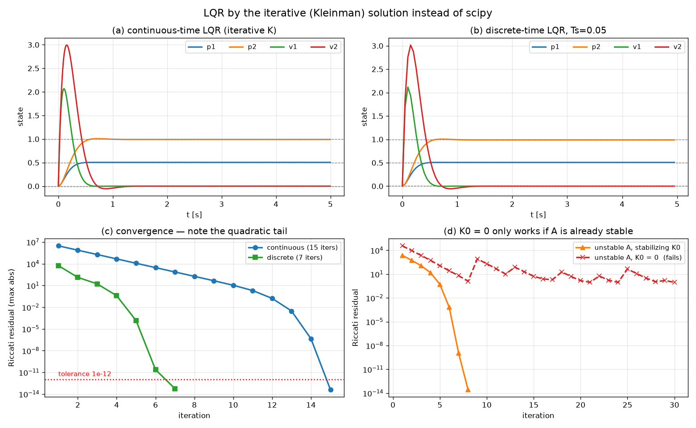

# 02-002 Optimal Control of Linear Systems

## 과제 (노션 공식)

> `lqr.py`에서는 scipy의 라이브러리의 `solve_continuous_are`, `solve_discrete_are` 함수를 사용하고 있습니다.
> 이 부분을 **강의자료의 Iterative solution 식을 이용하여 직접 구현**해보세요.

제출 파일: **`lqr.py`**

> 참고: 같은 폴더의 `lqr_compare.py`는 공식 과제가 아니라, Q·R이 극점과 성능에
> 어떤 영향을 주는지 따로 살펴본 것이다. 제출물은 `lqr.py`다.

---

## 구현한 식

강의자료의 반복 알고리즘:

```
K ← 0
repeat until P converges
    P ← vec⁻¹( −(I ⊗ (A−BK)ᵀ + (A−BK)ᵀ ⊗ I)⁻¹ · vec(Q + KᵀRK) )
    K ← R⁻¹BᵀP
end repeat
```

안쪽 한 줄이 무엇인지부터 정리했다. **리아푸노프 방정식을 vec 연산으로 선형계로 바꾼 것**이다.

현재 정책 $K$의 닫힌루프를 $M = A - BK$, 비용 가중치를 $N = Q + K^TRK$라 하면 풀어야 할 식은

$$M^TP + PM + N = 0$$

$\text{vec}(AXB) = (B^T \otimes A)\,\text{vec}(X)$ 를 쓰면

$$\text{vec}(M^TP) = (I \otimes M^T)\text{vec}(P), \qquad \text{vec}(PM) = (M^T \otimes I)\text{vec}(P)$$

두 항을 더해 $\text{vec}(P)$에 대해 풀면 강의자료의 식이 그대로 나온다.

$$\text{vec}(P) = -(I \otimes M^T + M^T \otimes I)^{-1}\,\text{vec}(N)$$

**이산시간도 같은 방식이다.** $M^TPM - P + N = 0$ 이므로 $\text{vec}(M^TPM) = (M^T \otimes M^T)\text{vec}(P)$를 써서

$$\text{vec}(P) = (I - M^T \otimes M^T)^{-1}\,\text{vec}(N)$$

numpy는 기본이 행 우선이라 `vec`은 `reshape(-1, order="F")`로 열 우선을 명시해야 한다. 여기서 틀리면 조용히 다른 답이 나온다.

---

## 검증



scipy 결과와 대조했다.

| | 반복 횟수 | ‖P_반복 − P_scipy‖ | ‖K_반복 − K_scipy‖ |
|---|---:|---:|---:|
| 연속시간 CARE | 15 | **4.9 × 10⁻¹⁴** | 6.5 × 10⁻¹³ |
| 이산시간 DARE (Ts=0.05) | 7 | 1.9 × 10⁻¹² | 3.7 × 10⁻¹³ |

배정밀도 한계까지 일치한다.

얻은 이득과 닫힌루프 극점:

```
K = [[97.048   3.731  15.292   1.394]
     [ 0.169  98.025   0.697  20.292]]

닫힌루프 고유값: −8.643 ± 5.036j,  −5.576 ± 4.351j
```

그림 (a)(b)는 이 K로 예제와 같은 시뮬레이션을 돌린 것이다. 목표 상태로 정상 수렴한다.

---

## 관찰 1 — 수렴이 두 국면으로 나뉜다

그림 (c)의 파란 곡선을 보면 모양이 중간에 꺾인다.

| 반복 | 잔차 |
|---:|---:|
| 1 | 3.0 × 10⁶ |
| 5 | 1.2 × 10⁴ |
| 10 | 1.1 × 10¹ |
| 12 | 1.7 × 10⁻¹ |
| 13 | 3.0 × 10⁻³ |
| 14 | 4.4 × 10⁻⁷ |
| 15 | 2.8 × 10⁻¹⁴ |

**앞쪽 11회는 잔차가 매번 4분의 1씩 줄어든다** (선형 수렴).
**뒤쪽 3회는 자릿수가 제곱으로 뛴다** — 10⁻³ → 10⁻⁷ → 10⁻¹⁴.

오차가 매 스텝 제곱되는 건 **뉴턴법의 특징**이다. 실제로 이 반복법은
리카티 방정식에 뉴턴법을 적용한 것과 같다 (Kleinman의 알고리즘).
그래서 처음엔 느리다가 해 근처에 오면 폭발적으로 정확해진다.

이산시간은 7회로 더 빨리 끝났다. $T_s = 0.05$가 짧아 $A_d$가 단위행렬에 가깝고,
$K=0$에서 시작한 초기 추정이 이미 해에 가까웠기 때문이다.

## 관찰 2 — K = 0 으로 시작해도 되는 조건이 있다

강의자료는 `K ← 0`으로 시작하라고 한다. 그런데 **아무 시스템에서나 되는 건 아니다.**

첫 반복은 $K=0$일 때의 리아푸노프 방정식을 푼다. 이때 $M = A - BK = A$ 이므로,
**해가 존재하려면 $A$ 자체가 안정해야 한다.**

이 시스템의 개루프 고유값은 −1.183±1.527j, −0.317±0.409j로 전부 왼쪽 반평면에 있다.
그래서 `K ← 0`이 통했다. 확인하려고 A를 일부러 불안정하게 바꿔봤다.

```
수정한 A 의 고유값: −3.018,  −0.648 ± 0.916j,  +1.315    ← 하나가 오른쪽
K=0 으로 시작한 결과: 잔차 9.15e-01,  P 가 양정치인가? False
```

그림 (d)의 빨간 선이 그것이다. 30회를 돌려도 잔차가 10⁰ 근처에서 튀기만 하고 수렴하지 않는다.
반면 **안정화 이득으로 시작하면 8회 만에 5×10⁻¹⁴까지** 수렴한다 (주황 선).

**반복법에는 "이미 안정한 정책에서 출발해야 한다"는 조건이 붙는다.**
scipy의 `solve_continuous_are`에는 이 제약이 없다 — 해밀토니안 행렬의 안정 고유공간을
직접 분해하는 완전히 다른 방법을 쓰기 때문이다.

---

## 정리

| | 반복법 (직접 구현) | scipy |
|---|---|---|
| 원리 | 정책을 고정해 리아푸노프를 풀고 정책을 개선, 반복 | 해밀토니안 행렬의 고유공간 분해 |
| 초기값 | **안정화 이득 필요** | 불필요 |
| 수렴 | 뉴턴법 — 후반에 제곱 수렴 | 반복 없음 (직접 계산) |
| 계산량 | 매 반복 $n^2 \times n^2$ 선형계 | $2n \times 2n$ 고유값 분해 1회 |
| 정확도 | 배정밀도 한계까지 동일 | — |

$n^2 \times n^2$ 선형계를 매번 푸는 건 n이 커지면 부담이다 (n=4면 16×16이지만 n=20이면 400×400).
실무에서 scipy를 쓰는 이유다. 다만 **이 반복 구조 자체가 강화학습의 policy iteration과 같다** —
"정책 평가 → 정책 개선"을 번갈아 하는 것. 03 RL에서 같은 구조를 다시 만난다.

---

## 파일

```
002_LQR/
├── lqr.py             ← 제출물. 반복법 구현 + 검증 + 시뮬레이션
├── report.md          ← 이 문서
├── run_lqr.log        ← 실행 로그
├── lqr_compare.py     (공식 과제 아님 — Q, R 영향 분석)
└── results/
    ├── lqr_iterative.png   ← 제출 그림
    └── lqr_tradeoff.png    (lqr_compare.py 결과)
```
