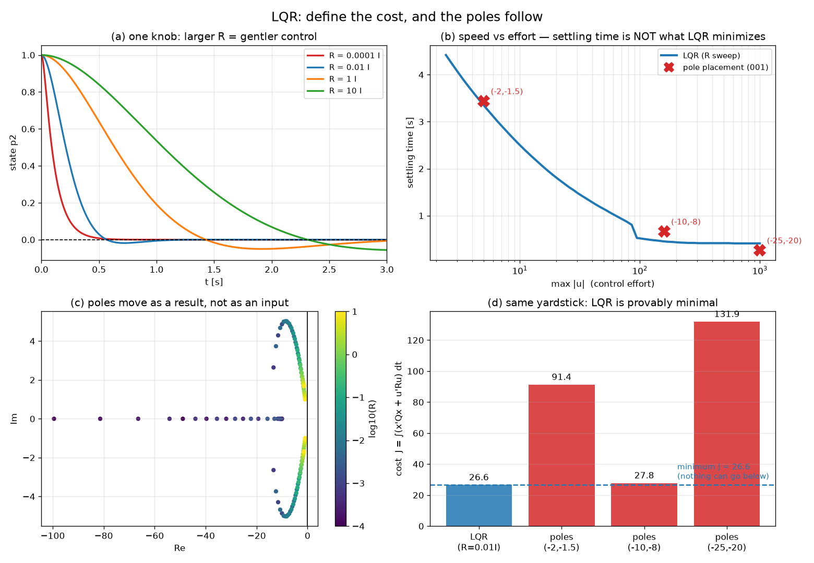

# 02-002 LQR — 극점을 고르지 말고 비용을 정하라

실행: `python lqr_compare.py` (numpy·scipy·matplotlib만 필요, 몇 초)

001에서 이런 불만이 남았다.

> 극점을 -10, -8에 놓으라는데 **왜 하필 그 값인가?** 기준이 없다.
> 그리고 제어입력이 999까지 튀는 걸 설계 단계에서 막을 방법이 없다.

LQR의 답은 이렇다. **극점을 고르지 마라. 무엇을 아끼고 싶은지를 적어라.**

$$J = \int_0^\infty \left( x^TQx + u^TRu \right) dt$$

- $Q$ — 상태가 목표에서 벗어나는 걸 얼마나 싫어하는가
- $R$ — 제어입력을 쓰는 걸 얼마나 아까워하는가

이 $J$를 최소화하는 $K$는 **리카티 방정식(CARE)** 을 풀면 딱 하나로 나온다.

$$A^TP + PA - PBR^{-1}B^TP + Q = 0, \qquad K = R^{-1}B^TP$$

---

## Part 1. 극점은 결과로 나온다

예제 코드와 같은 값을 썼다. $Q = \mathrm{diag}(100, 100, 1, 1)$, $R = 0.01 I$.

```
K = [97.05  3.73  15.29   1.39]
    [ 0.17 98.03   0.70  20.29]

닫힌루프 극점: -8.64 ± 5.04j,  -5.58 ± 4.35j
비용 J = 26.607
```

**극점을 지정한 적이 없다.** $Q$와 $R$만 정했는데 -8.64, -5.58이 나왔다.
001에서 손으로 고르던 값이 여기서는 계산 결과로 떨어진다.

그림 (c)를 보면 $R$을 바꿀 때 극점이 어떻게 움직이는지 자취가 보인다.
$R$이 작아지면 극점이 왼쪽으로 멀어지고(빨라지고), 커지면 원점 쪽으로 온다(느려진다).

## Part 2. 손잡이가 하나로 줄었다

$Q$는 고정하고 $R$만 바꿨다.

| $R$ | 정착시간 | max·\|u\| | 비용 J | 가장 느린 극점 |
|---:|---:|---:|---:|---:|
| 0.0001 | 0.41 s | 997.5 | 109.36 | −10.05 |
| 0.001 | 0.42 s | 314.0 | 39.82 | −10.63 |
| **0.01** | 0.52 s | 98.1 | **26.61** | −5.58 |
| 0.1 | 1.49 s | 30.1 | 34.54 | −2.90 |
| 1 | 2.65 s | 8.8 | 56.58 | −1.59 |
| 10 | 4.42 s | 2.4 | 96.33 | −0.93 |

001에서 극점 두 개를 손으로 더듬으며 저울질하던 것이,
**$R$ 하나를 키우고 줄이는 문제**로 바뀌었다.

- $R$ 작게 → 입력을 안 아낌 → 빠르지만 max·\|u\|가 1000까지
- $R$ 크게 → 입력을 아낌 → 부드럽지만 4초 넘게 걸림

그림 (a)에서 네 곡선이 그 저울질을 그대로 보여준다.

## Part 3. "최적"이 무슨 뜻인가 — 여기가 핵심

모든 제어기를 **같은 잣대**로 평가했다. 비용은 $Q, R=0.01I$ 기준.



| 방법 | 정착시간 | max·\|u\| | 비용 J | 최적 대비 |
|---|---:|---:|---:|---:|
| **LQR (R=0.01I)** | 0.52 s | 98.1 | **26.61** | 기준 |
| 극점배치 (−2, −1.5) | 3.44 s | 5.0 | 91.35 | +243% |
| 극점배치 (−10, −8) | 0.67 s | 159.0 | 27.83 | +4.6% |
| 극점배치 (−25, −20) | 0.27 s | 999.0 | 131.93 | +396% |

**LQR이 26.61로 최소다.** 이건 실험 결과가 아니라 리카티 방정식이 보장하는 것이다.
어떤 $K$를 가져와도 이 값보다 작아질 수 없다. 그림 (d)의 파란 점선이 그 바닥이다.

001에서 예제가 쓰던 (−10, −8)은 27.83으로 **최적에 4.6%밖에 못 미친다.** 꽤 좋은 선택이었다.
반면 (−2, −1.5)나 (−25, −20)은 서너 배 나쁘다. 손으로 고르면 이렇게 크게 빗나갈 수 있다.

### 그런데 반전이 있다

표를 다시 보면 **극점배치 (−25, −20)이 0.27초로 LQR(0.52초)보다 빠르다.**
그림 (b)에서도 그 빨간 X가 파란 곡선 아래에 있다.

모순이 아니다. **LQR은 정착시간을 최소화하지 않는다.** $J$를 최소화한다.

$J$ 안에는 $u^TRu$ 항이 들어 있어서, 999까지 쓰는 걸 **낭비로 계산해 벌점을 준다.**
그래서 LQR은 "조금 느리더라도 입력을 아끼는" 쪽을 고른 것이다. 그게 내가 시킨 일이니까.

> **"최적"은 내가 정의한 비용함수에 대해서만 최적이다.**
> 정착시간이 중요하면 $Q$를 키워야 하고, 액추에이터가 넉넉하면 $R$을 줄여야 한다.
> LQR은 판단을 대신해주는 게 아니라, **내 판단을 수식으로 적으면 나머지를 계산해주는 도구**다.

이게 001의 "극점을 무슨 기준으로?"에 대한 진짜 답이다. 기준은 여전히 내가 정한다.
다만 이제 **극점 4개가 아니라 $Q, R$이라는 의미가 분명한 언어로** 정한다.

## Part 4. 이산 LQR

001에서 연속시간 이득을 그대로 이산 루프에 갖다 쓰면 $T_s = 0.15$에서 **발산**했다.
이산 LQR은 애초에 이산 시스템 $(A_d, B_d)$로 리카티를 풀기 때문에 그런 일이 없다.

| $T_s$ | 이산 LQR 스펙트럴 반경 | 001의 emulation |
|---:|---:|---|
| 0.05 s | 0.757 안정 | 0.721 안정 |
| 0.10 s | 0.577 안정 | 0.673 안정 |
| 0.15 s | — | **1.844 발산** |
| 0.20 s | 0.347 안정 | **3.198 발산** |

제어기를 실제 하드웨어에 올릴 거면 **처음부터 이산으로 설계하는 게 맞다.**

---

## 아직 못 하는 것 → 003 QP

LQR로 두 가지가 해결됐다.

- ✅ 극점 선택 기준 → $Q, R$
- ✅ 속도-제어량 저울질 → $R$ 하나

하지만 **여전히 못 하는 게 있다.**

Part 2 표에서 $R = 0.001$일 때 max·\|u\| = 314다. 모터가 100까지밖에 못 낸다면?
$R$을 이리저리 바꿔가며 314가 100 밑으로 내려올 때까지 **더듬는 수밖에 없다.**

$$|u| \le 100$$

이 조건을 **직접 집어넣을 방법이 LQR에는 없다.** 리카티 방정식은 등식만 다루기 때문이다.

부등식 제약을 다루려면 최적화 문제를 다르게 풀어야 하고, 그게 **QP(Quadratic Programming)** 다.
그리고 QP를 매 스텝 푸는 것이 **MPC**다.

---

## 파일

```
002_LQR/
├── lqr_compare.py     # 전체 코드
├── report.md          # 이 문서
├── run.log            # 실행 로그
└── results/
    ├── lqr_tradeoff.png   # 4패널 그림
    └── summary.json       # 수치 요약
```
