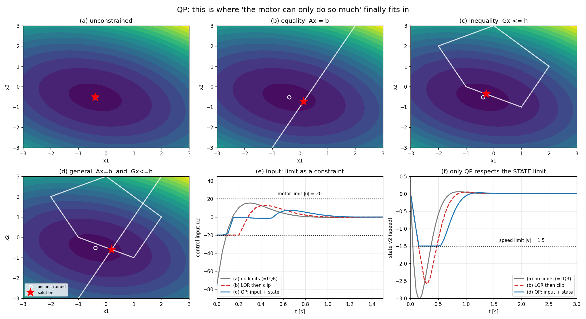

# 02-003 Quadratic Programming — 제약을 드디어 말할 수 있게 된다

실행: `python qp_study.py` (numpy·scipy·qpsolvers, 몇 초)

002에서 이렇게 끝났다.

> R = 0.001이면 max·\|u\| = 314다. **모터가 100까지밖에 못 낸다면?**
> R을 이리저리 바꿔가며 더듬는 수밖에 없다. 리카티 방정식은 등식만 다루니까.

QP는 그 부등식을 **문제에 직접 써넣는다.**

$$\min_x \tfrac{1}{2}x^TPx + q^Tx \quad \text{s.t.} \quad Ax = b, \; Gx \le h$$

목적함수는 LQR과 똑같은 이차형식이다. 달라진 건 **아래 두 조건이 붙었다는 것**뿐이다.

---

## Part 1. 제약이 붙으면 해가 밀려난다

예제 코드의 2차원 문제로 네 가지를 풀었다.

| | 해 | 비용 |
|---|---|---:|
| 무제약 | (−0.391, −0.522) | **−0.4304** |
| 등식만 $Ax=b$ | (0.132, −0.736) | −0.2925 |
| 부등식만 $Gx \le h$ | (−0.273, −0.364) | −0.3909 |
| 일반 (둘 다) | (0.200, −0.600) | −0.2680 |



위쪽 그림 (a)~(c)와 아래 왼쪽 (d)가 그 네 경우다.
흰 동그라미가 무제약 해, 빨간 별이 각 문제의 답이다.

**제약이 늘어날수록 비용은 반드시 커지거나 같다.** 선택지가 줄어드니 당연하다.
(c)를 보면 무제약 해가 오각형 밖에 있어서, 답이 **경계선 위로 끌려 나온** 게 보인다.

## Part 2. 예제 코드의 방식은 옳은가

`inequality_constrained_qp.py`는 부등식 QP를 이렇게 푼다.

> 무제약 해를 구한다 → 거기서 **위반된 제약만 골라** 등식으로 걸고 한 번 푼다

예제가 준 $q$에서는 정답과 정확히 일치한다. 그런데 **이게 일반적으로 맞는 방법인가?**

$q$를 무작위로 3000번 바꿔가며 솔버 답과 비교했다.

```
3000개 중 993개 실패 (33.1%)

  q=[ 1.64 -2.76]  추측=[-2.    2.   ]  정답=[-1.942  1.883]
  q=[ 1.28  2.75]  추측=[-1.    0.   ]  정답=[-0.184 -0.408]
  q=[ 4.36  0.50]  추측=[-1.   -0.   ]  정답=[-1.427  0.855]
```

**세 번에 한 번꼴로 틀린다.** 예제의 $q$에서 맞은 건 운이 좋았던 것이다.

왜 틀리냐면 — 무제약 해에서 위반된 제약을 걸고 풀면, **그 결과가 다른 제약을 새로 위반**하거나
반대로 **걸 필요 없던 제약을 억지로 걸어** 해를 밀어낼 수 있기 때문이다.
실패 사례들은 전부 실행 가능(feasible)하긴 하지만 최적이 아니다.

진짜 active set은 **반복해서 찾아야** 한다. 그 일을 `solve_qp` 같은 솔버가 대신 해준다.
예제 코드는 원리를 보여주려는 것이지 실전 알고리즘이 아니다.

## Part 3. LQR을 QP로 다시 쓰고, 제약을 넣는다 — 여기가 핵심

001·002와 같은 시스템. 예측구간 3초(N=60), 변수는 $u_0 \ldots u_{59}$ **120개**.

미래 상태를 입력의 함수로 한 줄에 쓸 수 있다.

$$X = S_x x_0 + S_u U$$

이걸 비용에 대입하면 $U$에 대한 이차함수가 되고, 그게 곧 QP다.
LQR과 **같은 문제를 다르게 적은 것**뿐이다. 대신 이제 제약을 붙일 수 있다.

- **입력 제약** $|u| \le 20$ — 모터가 낼 수 있는 최대 토크
- **상태 제약** $|v| \le 1.5$ — 속도가 이 이상 나면 안 됨

| 방법 | max·\|u\| | max·\|v\| | 비용 J | 제약 |
|---|---:|---:|---:|---|
| (a) 제약 없는 QP (= LQR) | 75.3 | 3.05 | 600.3 | **입력·속도 둘 다 위반** |
| (b) LQR 후 입력 잘라내기 | 20.0 | 2.60 | 713.4 | **속도 위반** |
| (c) QP, 입력 제약만 | 20.0 | 2.60 | 713.3 | **속도 위반** |
| (d) QP, 입력 + 상태 제약 | 20.0 | **1.50** | 785.7 | **OK** |

### 읽는 법

**(a)** LQR은 한계를 모른다. 75까지 쓰겠다고 한다. 실제 모터로는 낼 수 없는 값이니 이 계획은 종이 위에서만 최적이다.

**(b)** 흔히 쓰는 임시방편 — LQR로 계산하고 한계에서 잘라버리기(clipping).
입력 한계는 지켜진다. 그림 (e)에서 빨간 점선이 −20에 딱 붙어 있다.
**그런데 속도가 2.60까지 간다.** 1.5를 훨씬 넘는다.

**여기가 이 과제의 요점이다.** 자르기로는 "속도가 1.5를 넘지 마라"를 **표현할 방법이 아예 없다.**
입력을 자른다고 상태가 어디로 갈지 통제되는 게 아니기 때문이다.
(c)처럼 QP를 쓰더라도 입력 제약만 넣으면 결과는 똑같다.

**(d)** 상태 제약까지 넣어야 비로소 지켜진다. 그림 (f)에서 파란 선이 −1.5에 **정확히 붙어서 미끄러지는** 게 보인다.
QP가 "지금 이만큼 세게 밀면 0.3초 뒤에 속도가 한계를 넘겠구나"를 **미리 계산해서** 입력을 줄인 것이다.
비용은 785.7로 (b)보다 높지만, (b)는 애초에 규칙 위반이라 비교 대상이 아니다.

> **QP가 LQR보다 나은 점은 "더 좋은 답을 준다"가 아니다.**
> **LQR이 애초에 표현할 수 없는 요구를 표현할 수 있다는 것이다.**

### FSAE로 옮기면

- **입력 제약** — 모터 토크 한계, 조향각 한계, 인버터 전류 한계
- **상태 제약** — 타이어 마찰원 $\sqrt{F_x^2+F_y^2} \le \mu F_z$, 트랙 경계(콘 마진), 배터리 SOC

**타이어 마찰 한계와 트랙 경계는 둘 다 상태 제약이다.** 입력을 자르는 걸로는 절대 못 지킨다.
자율주행 레이싱에서 MPC를 쓰는 이유가 정확히 이것이다.

## Part 4. 실시간에 풀 수 있나

MPC는 이 QP를 **매 제어주기마다** 푼다. 그래서 속도가 곧 실현 가능성이다.

| 예측구간 N | 변수 개수 | QP 1회 | 제어주기(50ms) 대비 |
|---:|---:|---:|---:|
| 10 | 20 | 0.09 ms | 0.2 % |
| 20 | 40 | 0.17 ms | 0.3 % |
| 40 | 80 | 0.57 ms | 1.1 % |
| 60 | 120 | 1.37 ms | 2.7 % |
| 100 | 200 | 5.53 ms | 11.1 % |

여유가 충분하다. 다만 **N에 대해 초선형으로 늘어난다** — 10배 늘리니 60배가 됐다.
예측구간을 길게 잡을수록 멀리 보지만 계산이 급격히 무거워진다. 이 저울질이 MPC 설계의 핵심 중 하나다.

---

## 아직 남은 것 → 004 MPC

지금 (d)는 **한 번 풀고 그 계획을 끝까지 실행**한다 (open-loop).
모델이 완벽하고 외란이 없으면 이게 최적이다.

그런데 실제로는 — 노면이 바뀌고, 바람이 불고, 모델이 틀린다.
3초 전에 세운 계획은 이미 어긋나 있다.

**해법은 단순하다. 매 스텝 상태를 다시 재고 QP를 다시 푼다.**
그리고 첫 번째 입력만 쓰고 나머지는 버린다.

그것이 **MPC**다. QP는 이미 다 만들었으니, 004는 이걸 반복문 안에 넣는 것이다.

---

## 파일

```
003_Quadratic_Programming/
├── qp_study.py    # 전체 코드
├── report.md      # 이 문서
├── run.log        # 실행 로그
└── results/
    ├── qp_study.png   # 6패널 그림
    └── summary.json   # 수치 요약
```
