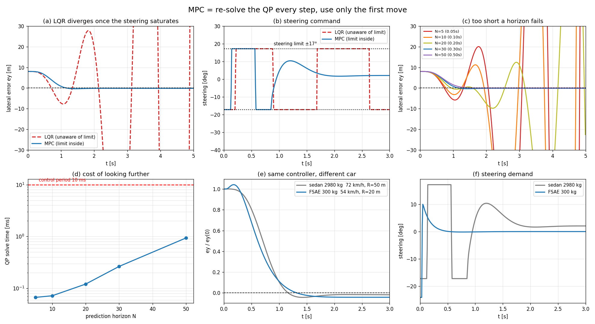

# 02-004 Linear MPC — 매 스텝 다시 푸는 것

실행: `python mpc_study.py` (numpy·scipy·qpsolvers, 1~2분)

003에서 이렇게 끝났다.

> 지금은 **한 번 풀고 그 계획을 끝까지 실행**한다. 모델이 완벽하면 최적이다.
> 그런데 노면이 바뀌고 모델이 틀리면 3초 전 계획은 이미 어긋나 있다.

**MPC의 답: 매 스텝 상태를 다시 재고 QP를 다시 푼다. 첫 번째 입력만 쓰고 나머지는 버린다.**

003에서 QP는 이미 다 만들었다. 004는 그걸 반복문 안에 넣는 것이다.

```python
for each control step:
    x = measure_state()
    U = solve_qp(...)      # N스텝 계획 전체
    apply(U[0])            # 첫 개만 쓰고 버림
```

---

## 문제 설정 — 차량 경로추종

이번 예제는 **차량 횡방향 제어**다. 지금 FSAE에서 만들고 계신 드라이버 모델과 같은 문제다.

상태는 경로 기준 오차 좌표다.

$$x = [e_y, \dot{e}_y, e_\psi, \dot{e}_\psi]^T$$

- $e_y$ — 경로 중심선에서 벗어난 횡방향 거리 [m]
- $e_\psi$ — 경로 접선 대비 차량 방위각 오차 [rad]
- 입력 $u = \delta$ (앞바퀴 조향각), **한계 ±0.3 rad = ±17°**
- 외란 $d$ — 곡률항 (코너를 돌면 계속 밀어내는 힘)

예제 차량은 **2980 kg, 축거 5.24 m** 짜리 대형차다. 72 km/h로 반경 50 m 코너(0.82 g)를 돈다.

시험 조건은 최악으로 잡았다: **경로에서 8 m 벗어났고, 방위각도 +17° 틀어져 있다** (더 벌어지는 방향).

이때 **무제약 LQR이 처음 요구하는 조향각은 −953°다.** 물리적으로 낼 수 없다.

---

## Part 2. LQR은 발산하고 MPC는 복귀한다



| 제어기 | 최대 \|ey\| | 최종 ey | 조향 포화 | 결과 |
|---|---:|---:|---:|---|
| LQR (한계를 모름) | 693.19 m | 406.78 m | 100 % | **발산** |
| MPC (N=30) | 8.01 m | −0.14 m | 17 % | **복귀 성공** |

**LQR이 발산한다.** 소프트웨어에서 자르든, 하드웨어가 알아서 잘리든 결과는 같다.
그림 (b)를 보면 빨간 점선이 **±17°를 왔다 갔다 하는 사각파**가 된다. 전형적인 포화 한계사이클이다.

왜 이렇게 되냐면 — LQR은 **"요구한 만큼 조향이 된다"고 믿고** 이득을 계산했다.
실제로는 −953°를 요구했는데 −17°만 들어간다. 오차는 계속 커지고,
커진 오차가 더 큰 요구를 낳고, 그 요구는 또 잘린다. **되돌아올 길이 없다.**

MPC는 처음부터 **"실제로 낼 수 있는 계획"만** 세운다. 조향 포화가 17%인 게 인상적이다 —
필요한 만큼만 한계에 붙였다가 뗀다. 그림 (b)의 파란 선을 보면 0.1~0.9초 동안만 한계에 있다가
부드럽게 빠져나온다.

> **핵심: 제약을 나중에 잘라서 처리하면 안 된다. 설계 안에 넣어야 한다.**

## Part 3. 얼마나 멀리 봐야 하나 — 그리고 예상 밖의 결과

$T_s = 10$ ms이므로 N=30은 **0.3초 앞**을 본다는 뜻이다.

| N | 예측구간 | 종단비용 O | 종단비용 X | QP 1회 | 주기 대비 |
|---:|---:|---:|---:|---:|---:|
| 5 | 0.05 s | **발산** | 9.29 m | 0.069 ms | 0.7 % |
| 10 | 0.10 s | **발산** | 8.60 m | 0.073 ms | 0.7 % |
| 20 | 0.20 s | **발산** | 8.18 m | 0.129 ms | 1.3 % |
| 30 | 0.30 s | 8.01 m | 8.06 m | 0.266 ms | 2.7 % |
| 50 | 0.50 s | 8.01 m | 8.01 m | 0.915 ms | 9.2 % |

### (1) 예측구간이 짧으면 실패한다

그림 (c)에서 N=5(빨강), N=10(주황), N=20(올리브)이 진동하다 발산한다.
20 m/s로 달리는 차에게 0.1초는 **2 m 앞**이다. 그 안에서만 최적을 찾으니 근시안적이 된다.
N=30(0.3초, 6 m 앞)부터 안정된다.

### (2) 종단비용이 오히려 해가 된다 — 이게 예상 밖이었다

종단비용(terminal cost)은 보통 MPC를 **안정화시키는** 장치로 배운다.
"예측구간 이후는 무한구간 LQR이 처리한다"고 가정하고 $P_\infty$를 끝에 붙이는 것이다.

그런데 표를 보면 **종단비용을 넣은 쪽(O)이 짧은 N에서 발산하고, 뺀 쪽(X)이 멀쩡하다.**

이유를 생각해보면 명확하다. 종단비용의 가정은 **"이후에는 제약 없이 LQR로 처리한다"**이다.
그런데 지금은 조향이 한계에 걸려 있다. **그 가정이 거짓이다.**

MPC는 "예측구간 끝에서 −953°로 크게 꺾어 한 번에 해결하면 되니까 지금은 좀 덜 꺾어도 돼"라고
낙관한다. 그런데 그 −953°는 영원히 오지 않는다.

교과서적으로는 **종단비용이 유효하려면 종단 집합이 제약 하에서 제어 불변(control invariant)이어야 한다.**
여기선 그 조건이 깨져 있다. N이 충분히 길면 종단 근처에서 이미 안정화돼 있어서 둘 다 같아진다.

### (3) 계산 시간

N=50에서도 QP 1회가 0.9 ms로, 10 ms 제어주기의 9%다. 여유가 충분하다.
다만 그림 (d)를 보면 **N에 대해 초선형**이다 — N을 10배 늘리니 13배가 됐다.

## Part 4. 같은 제어기를 FSAE 차량에

**제어기 코드는 한 줄도 안 바꿨다. 모델 파라미터만 갈아끼웠다.**

| | 질량 | 축거 | US 그래디언트 | 주행조건 | 최대 조향 | 정착 |
|---|---:|---:|---:|---|---:|---:|
| 예제 세단 | 2980 kg | 5.24 m | 0.01104 | 72 km/h, R=50 m (0.82 g) | 17.2° | 1.58 s |
| **FSAE** | **300 kg** | **1.53 m** | **0.00119** | 54 km/h, R=20 m (**1.15 g**) | 24.1° | **0.94 s** |

FSAE 쪽은 **더 높은 횡가속도(1.15 g)로 도는데도 훨씬 빨리 복귀한다.**
질량이 1/10, 요 관성이 1/41이라 그만큼 민첩하다.
언더스티어 그래디언트도 0.00119로 세단(0.01104)의 1/9 — 거의 중립에 가깝다.

> FSAE 파라미터는 질량·조향각만 MECar 2027 목표치이고,
> 요 관성과 코너링 강성은 이 급 차량의 통상값으로 **추정한 것**이다.
> 실제 값이 나오면 그 자리에 넣기만 하면 된다.

**이것이 MPC의 실용적 장점이다.** 제어기가 모델을 파라미터로 받으니,
차가 바뀌면 모델만 갈아끼우면 된다. 극점배치처럼 매번 손으로 다시 튜닝할 필요가 없다.

---

## 02 챕터를 마치며

| 과제 | 해결한 것 | 남긴 문제 |
|---|---|---|
| 001 Intro | 상태피드백으로 극점 배치 | 극점을 무슨 기준으로? 입력이 999까지 튄다 |
| 002 LQR | Q, R로 비용을 정의 → 극점은 결과 | 부등식 제약을 못 넣는다 |
| 003 QP | 제약을 문제 안에 직접 | 한 번 풀고 끝 (open-loop) |
| 004 MPC | 매 스텝 다시 풀기 | **모델이 틀리면?** |

마지막 칸이 남는다. MPC는 **모델이 맞다는 전제 위에 서 있다.**
$f_\text{true} \ne f_\text{model}$ 이면 예측이 틀리고, 예측이 틀리면 최적해가 최적이 아니다.

**서용화 조교님 연구 슬라이드의 첫 줄이 정확히 이것이다.**

> Dynamics Modeling Error: $f_\text{true} \ne f_\text{model}$ → state mismatch → MPC performance ↓

그 해법이 **모델을 데이터로 학습시키는 것**(dynamics learning)이고,
그러면 **03 RL**로 넘어간다.

여기서 쓴 바이시클 모델도 마찬가지다. 타이어를 $F_y = 2C\alpha$ 선형으로 놨는데,
실제 타이어는 매직포뮬러처럼 포화한다. 1.15 g로 도는 FSAE 차량은 이미 그 비선형 영역에 있다.

---

## 파일

```
004_Linear_MPC/
├── mpc_study.py   # 전체 코드 (차량 모델 + MPC + 시뮬레이터)
├── report.md      # 이 문서
├── run.log        # 실행 로그
└── results/
    ├── mpc_study.png  # 6패널 그림
    └── summary.json   # 수치 요약
```
