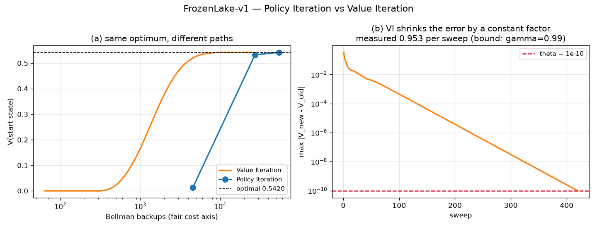
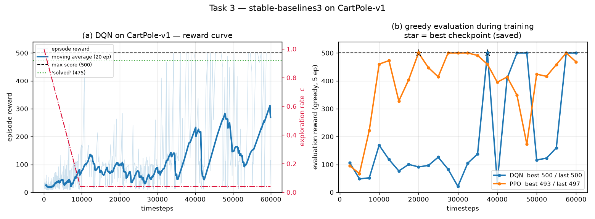

# 03 Reinforcement Learning

## 과제 (노션 공식)

> **제출물**: Task 1·2·3 코드 파일 + Task 3 의 reward graph
> **기술할 것**: Task 1&2 의 gym 환경 / Task 3 의 gym 환경 + stable-baselines 모델
> **설명 1**: policy iteration 과 value iteration 결과 비교
> **설명 2**: Task 3 모델의 특성과 학습 결과를 연관지어 설명

| | 환경 | 모델 |
|---|---|---|
| Task 1 | `FrozenLake-v1` (4×4, `is_slippery=True`) | Policy Iteration |
| Task 2 | `FrozenLake-v1` (동일) | Value Iteration |
| Task 3 | `CartPole-v1` | **DQN** (stable-baselines3), 비교용 PPO |

---

## Task 1·2 결과

FrozenLake 는 미끄러지는 얼음판이다. 의도한 방향으로 1/3, 좌우 직각으로 각 1/3 확률로 움직인다.
구멍에 빠지면 종료, 목표에 닿으면 보상 1. γ = 0.99, θ = 1e-10.

두 방법 모두 같은 정책에 도달했다.

```
   ←  ↑  ↑  ↑
   ←  H  ←  H
   ↑  ↓  ←  H
   H  →  ↓  G
```

시작 상태에서 왼쪽(벽)으로 미는 것이 최적이라는 게 흥미롭다. 미끄러지기 때문에
**아래쪽 구멍으로 빨려들 위험을 줄이려면 벽에 붙는 편이 낫다.** 사람의 직관과 반대다.

| | Policy Iteration | Value Iteration |
|---|---:|---:|
| 바깥 반복 | **3** | 420 |
| 전체 sweep | 848 | 420 |
| **벨만 백업** | **54,272** | **26,880** |
| 시간 | 0.046 초 | 0.040 초 |
| V(시작상태) | 0.54202593 | 0.54202593 |
| 정책 동일 여부 | **True** | **True** |

실제 2,000 에피소드 성공률 **73.2 %**.
V(시작) = 0.542 와 성공률 73.2% 가 다른 이유는 **할인** 때문이다.
γ = 0.99 이고 목표까지 평균 30스텝쯤 걸리므로 0.99³⁰ ≈ 0.74 가 곱해진다.
V 는 "할인된 기대 보상"이고 성공률은 "할인 없는 도달 확률"이다.

---

## 설명 1 — Policy Iteration vs Value Iteration



### (1) 같은 답에 도달한다

V 의 최대 차이가 3.55 × 10⁻¹¹, 정책은 완전히 동일하다.
벨만 최적방정식은 축소사상(contraction)이라 **해가 유일**하기 때문에 당연한 결과다.
차이는 답이 아니라 **거기 도달하는 경로**에 있다.

### (2) "반복 횟수"로 비교하면 오해한다

PI 는 3회, VI 는 420회. 140배 차이로 보인다. 그런데 이건 공정한 비교가 아니다.
**PI 의 한 번의 반복 안에 정책평가 sweep 이 수백 번 들어있다.**

| PI 반복 | 그 안의 정책평가 sweep |
|---:|---:|
| 1 | 71 |
| 2 | 355 |
| 3 | 422 |

벨만 백업 총 횟수로 재면 **PI 54,272 vs VI 26,880 — VI 가 절반이다.**
그림 (a) 의 가로축을 백업 수로 잡은 이유가 이것이다. 로그축에서 주황(VI)이
파랑(PI)보다 훨씬 왼쪽에서 최적값에 닿는다.

### (3) 진짜 차이는 "정책평가를 얼마나 끝까지 하느냐"

PI 가 백업을 두 배 쓴 이유는 정책평가를 θ = 1e-10 까지 밀어붙였기 때문이다.
그럴 필요가 없다. 평가를 도중에 끊는 것을 **modified policy iteration** 이라 한다.

| 평가 θ | 바깥 반복 | 벨만 백업 | 최적 정책? |
|---:|---:|---:|:---:|
| 1e-1 | 4 | 832 | ✗ |
| 1e-2 | 3 | 3,712 | ✗ |
| **1e-4** | 3 | **17,024** | **✓** |
| 1e-6 | 3 | 29,504 | ✓ |
| 1e-10 | 3 | 54,272 | ✓ |
| **VI (= 1 sweep)** | 420 | 26,880 | ✓ |

너무 대충 끊으면(1e-1, 1e-2) 최적이 깨진다. 그러나 **1e-4 에서 끊으면
최적 정책을 유지하면서 백업이 3분의 1(17,024)로 줄고, VI 보다도 싸다.**

여기서 두 방법의 관계가 드러난다.

> **VI 는 "정책평가를 1 sweep 만 하는 PI" 다.**
> PI 는 평가를 끝까지 하는 극단, VI 는 한 번만 하는 극단이고,
> 실제로 가장 빠른 지점은 그 사이 어딘가에 있다.

### (4) 수렴 양상도 다르다

그림 (b). VI 의 오차는 매 sweep 마다 **일정한 비율로 줄어든다** (선형 수렴).
측정값이 sweep 당 0.953 배였다. 이론적 상한은 γ = 0.99 이므로 그보다 빠르다.
벨만 연산자가 γ-축소사상이라는 것이 이 직선의 정체다.

PI 는 그림 (a) 에서 점 3개로 끝난다. 매 반복이 "그 정책 하에서의 정확한 답"으로
점프하므로 계단식이다. **02 LQR 의 Kleinman 반복법과 같은 구조**다.

| | 02 LQR | 03 RL |
|---|---|---|
| 평가 단계 | K 고정 → 리아푸노프 방정식 풀어 P | π 고정 → 벨만 기대방정식 풀어 V |
| 개선 단계 | K = R⁻¹BᵀP | π = argmax Q |
| 평가의 정체 | 선형방정식 | 선형방정식 |
| 수렴 | 뉴턴법 (제곱 수렴) | 유한 회 (정책 수가 유한) |

`task1_policy_iteration.py` 에 정책평가를 선형방정식 `(I − γP_π)V = r_π` 로
직접 푸는 함수도 넣었다. 반복 3회, 0.0022초로 같은 답이 나온다.
02 에서 리아푸노프를 vec/크로네커로 푼 그 자리다.

---

## Task 3 결과 — DQN on CartPole-v1



CartPole 은 Task 1·2 와 상황이 근본적으로 다르다.

| | FrozenLake | CartPole |
|---|---|---|
| 상태 | 16개 (표로 표현 가능) | 4차원 **연속** (위치·속도·각도·각속도) |
| 전이 모델 P | 환경이 공개 | 모름 |
| 접근법 | 동적계획법 (DP) | **model-free + 함수근사** |

표를 만들 수 없으니 Q 를 신경망(256-256 MLP)으로 근사하고,
모델을 모르니 직접 굴려본 경험으로 배운다.

| | 최고 체크포인트 | 마지막 시점 | 학습 시간 | 에피소드 |
|---|---:|---:|---:|---:|
| **DQN** | **500.0 ± 0.0** | 134.3 ± 3.7 | 104 초 | 830 |
| PPO (비교용) | 444.2 ± 72.6 | 500.0 ± 0.0 | 58 초 | 439 |

60,000 timesteps, seed 42. 평가는 탐험 없이(greedy) 30 에피소드.

---

## 설명 2 — DQN 의 특성이 학습 결과에 그대로 나타난다

DQN 의 성질 네 가지가 위 곡선의 네 가지 특징과 하나씩 대응한다.

### 특성 ① ε-greedy 탐험 → 초반 정체 구간

DQN 은 가치함수만 배우고 정책을 따로 갖지 않는다. 행동은 "Q 가 최대인 것"이고,
탐험은 확률 ε 로 무작위 행동을 섞어서 만든다.
설정은 `exploration_fraction=0.16` — 앞 16% 구간에서 ε 를 1.0 → 0.04 로 낮춘다.

| timestep | 평균 보상 | ε |
|---|---:|---:|
| 0 ~ 10,000 | 36.7 | 0.628 |
| 10,000 ~ 20,000 | 63.4 | 0.040 |
| 20,000 ~ 30,000 | 76.5 | 0.040 |
| 30,000 ~ 40,000 | **135.3** | 0.040 |
| 40,000 ~ 50,000 | 131.8 | 0.040 |
| 50,000 ~ 60,000 | 85.4 | 0.040 |

그림 (a) 의 빨간 점선이 ε 다. 앞 10,000 스텝은 행동의 60% 이상이 무작위라
막대가 설 수가 없다. **초반 평평한 구간은 학습 실패가 아니라 설계된 탐험이다.**
ε 가 0.04 로 떨어지는 지점과 보상이 오르기 시작하는 지점이 정확히 겹친다.

### 특성 ② off-policy + replay buffer → 표본 효율은 좋지만 느리다

DQN 은 버퍼에 쌓인 과거 경험을 반복해서 재사용한다(off-policy).
같은 60,000 스텝에서 DQN 은 830 에피소드, PPO 는 439 에피소드를 돌았는데
**학습 시간은 DQN 104초, PPO 58초로 DQN 이 두 배 가까이 걸렸다.**
`gradient_steps=128` 로 매번 버퍼에서 128번씩 학습하기 때문이다.
환경 상호작용이 비싼 문제(실제 로봇 등)에서는 이 교환이 유리하지만,
CartPole 처럼 시뮬레이션이 싼 문제에서는 손해다.

### 특성 ③ 부트스트랩 + 과대추정 → **성능 붕괴**

이번 실행에서 가장 뚜렷하게 나온 현상이다.

```
이동평균 최고   249.5  @ timestep 47,135
마지막 50 에피소드 평균  74.7
```

그림 (b) 의 파란 선을 보면 500 → 80 → 500 → 120 → 420 → 290 → 60 으로
**널뛴다.** 학습을 더 했는데 성능이 나빠지는 구간이 반복해서 나타난다.

원인은 DQN 의 학습 목표가 자기 자신이라는 데 있다.

$$y = r + \gamma \max_{a'} Q_{\text{target}}(s', a')$$

max 연산은 추정 오차를 체계적으로 위쪽으로 밀어올린다(과대추정 편향).
그 부풀려진 값이 다시 목표가 되어 되먹임된다. 지도학습처럼 고정된 정답이 없고
**과녁이 스스로 움직이는 구조**라, 수렴이 보장되지 않는다.

target network(`target_update_interval=10`)와 replay buffer 가 이걸 완화하려는 장치지만
없애지는 못한다. CartPole 에서 DQN 이 무너지는 것은 잘 알려진 현상이다.

**그래서 최고 시점 가중치를 저장하는 장치가 사실상 필수다.**
`EvalCallback` 으로 2,500 스텝마다 탐험 없이 평가하고 최고점을 남겼다.
이 장치가 없었으면 제출 성능이 134.3 이 됐을 것이다 (실제 최고는 500.0).
001 MLP 에서 best validation 가중치를 저장한 것과 같은 발상이다.

### 특성 ④ 이산 행동만 가능

DQN 은 모든 행동의 Q 를 출력하고 그중 최대를 고르므로 **행동이 유한해야 한다.**
CartPole 은 좌/우 2개라 문제없다. 조향각이나 스로틀 같은 연속 제어에는
바로 쓸 수 없고, DDPG·SAC·PPO 처럼 정책을 직접 출력하는 방법이 필요하다.

### PPO 와의 대조로 확인

PPO 는 on-policy 이고 정책을 직접 출력하며, 한 번의 갱신 폭을 클리핑으로 제한한다.
그 결과가 그림 (b) 의 주황 선이다 — **DQN 보다 훨씬 매끄럽게 올라간다.**
마지막 시점에서 500.0 ± 0.0 으로 끝났다. DQN 의 붕괴가 알고리즘 특성 때문이지
하이퍼파라미터를 잘못 잡아서가 아니라는 근거다 (둘 다 RL Zoo 튜닝값 사용).

> 부수적 관찰: PPO 의 "최고 체크포인트"(444.2 ± 72.6)가 "마지막 시점"(500.0)보다 낮다.
> 체크포인트 선택이 5 에피소드 평가로 이뤄져서, 운 좋게 500 이 나온 이른 시점이
> 최고로 기록됐기 때문이다. 30 에피소드로 다시 재니 뒤집혔다.
> **평가 표본이 적으면 모델 선택 자체가 잡음을 탄다.**

---

## 파일

```
03_Reinforcement_Learning/
├── task1_policy_iteration.py   ← 제출물
├── task2_value_iteration.py    ← 제출물 (PI 비교 포함)
├── task3_dqn.py                ← 제출물
├── report.md                   ← 이 문서
├── run_task3.log
└── results/
    ├── task3_reward.png        ← 제출물 (reward graph)
    ├── task12_pi_vs_vi.png
    ├── task12_summary.json / task3_summary.json
    ├── rewards_dqn.csv / rewards_ppo.csv
    ├── dqn_cartpole.zip / ppo_cartpole.zip
    └── eval_dqn/ , eval_ppo/   (best_model, evaluations.npz)
```

실행 순서: `task1` → `task2` (task1 을 import) → `task3`

## 리더보드 기록값

- Task 1&2 환경: **FrozenLake-v1 (4×4, slippery)** — PI 3회 / VI 420회, 성공률 73.2%
- Task 3: **CartPole-v1 + DQN** — 최고 체크포인트 **500.0 ± 0.0** (만점)
